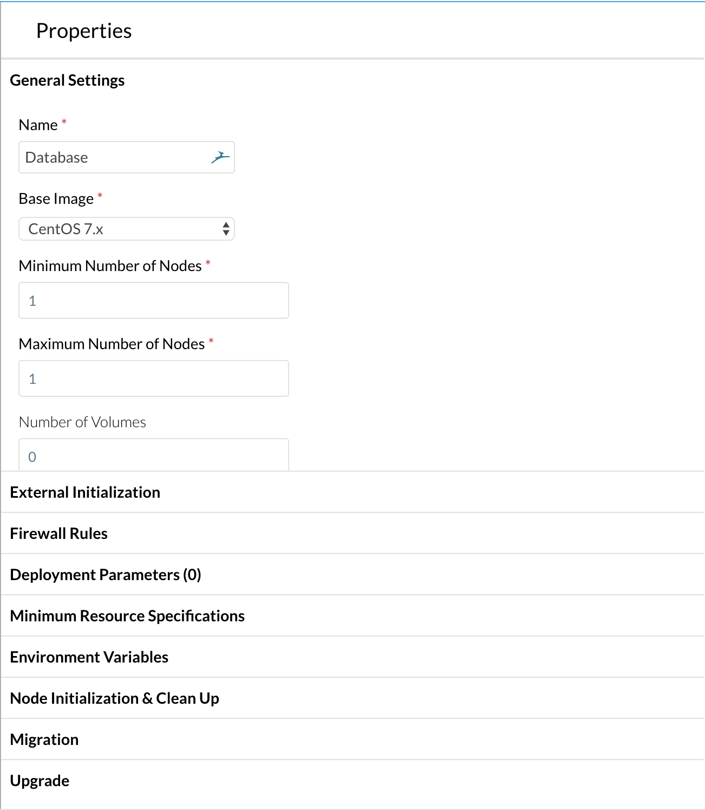
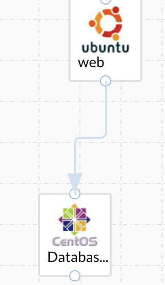
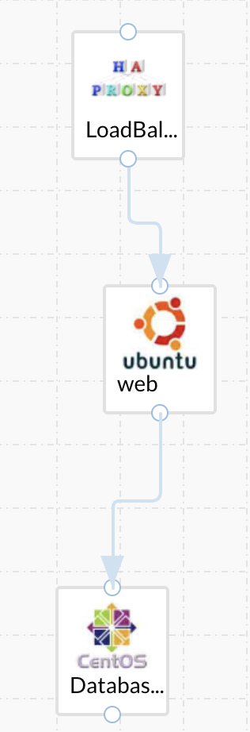
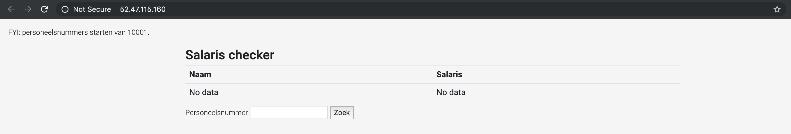

# ccc-provision

This repository contains the source code & model of a simple 3-tier Cisco Cloudcenter Suite deployment that I've created. The README.md also explains all the steps I took to get to this solution.

## tl;dr

If you just want to deploy this application yourself, set up your cloud(s) by going to admin --> clouds in the workload manager. Next, download the [threetier.zip](threetier.zip) file, go to "App profiles" and import it by clicking IMPORT.

Finally, you can go to Deployments --> new deployment and follow the GUI. When your application is in the "deployed" state, you can "access application" and start using it.

## Modeling an application

### Getting started

To start modeling application in Cloudcenter, you can go to App profiles --> Model. I always select N-Tier application because it gives you the most flexibility.

Let's start by providing some settings by going to the Basic Information tab. We'll fill in the name and version. You can specify some extra information like description, logo and protocol but we'll leave those on default this for this project.

Now that our required settings have been set, we can go into the Topology Modeler tab and start modeling our application.

### Choose your granularity

For most applications like frontend, middleware, backend and database, I like using the basic OS service instead of the other, more specific, images. The service-specific images often have outdated software versions so you'll have to provide scripts to update them anyways. Why not just do a clean install?

CloudCenter offers a drag-and-drop interface so you'll find it easy to create multi-tier applications. All icons that you drag into the model represent a tier; so no need to drag multiple webservers into there to create a load balanced environment.

### Database

I like to start with the lowest tier and build up applications as we go. Since our database is the lowest tier, we can start with this one. I chose to host MySQL on CentOS 7.x so we'll start by dragging the OS service CentOS into our modeler. We'll change the name to "Database" and since we don't want to load balance traffic to our database (because replication in MySQL is a pain in the ass ;) ), we'll limit the maximum number of nodes to 1.



The External Initialization section allows us to execute scripts at different stages of our deployment. I like to specify my startup config under Node Initialization & Clean Up so we'll skip this section for now. Our security policies are set in the Firewall Rules section. You can go as specific as you want here. For the purpose of this demo, I'll allow access to port 3306 from every network (0.0.0.0/0).

In the Node Initialization & Clean Up tab, we can setup our Initialization script. For installing MySQL on CentOS 7, I created a [script](mysql.sh) that we'll call in the Initialization script field by selecting URL or Command and pasting "https://raw.githubusercontent.com/robinverstraelen/ccc-provision/master/mysql.sh" in the text field. This will get the mysql.sh file from github and execute it (using bash).

There is one last, very important, step that we have to take. Cloudcenter secures it's VM's in a way that sudo commands have to be whitelisted. We'll just take all the commands that we used in [mysql.sh](mysql.sh) and paste them in there. This would look something like "yum;rpm;systemctl;echo;mkdir;tee;grep".

We'll leave the rest of the sections at there default values.

### Web

For the purpose of variety, we'll choose Ubuntu 16.04 for our webserver. Ubuntu 18.04 is more recent but at the time of making this guide, the custom cloudcenter image doesn't yet exist on GCP. We'll give our tier a name of "web" and since traffic to web will be load balanced, we'll set the Minimum Number of Nodes to 2.

Next, we'll grab the lowest dot on the web tier icon and attach it to the top dot on the Database tier.



This will make sure that, during the deployment, the lowest tier will be provisioned first. The other tiers will be provisioned bottom-up.

We'll allow traffic on port 80 from anywhere in the Firewall Rules section and go straight to the Node Initialization section where we'll paste in the url to our web.sh script (https://raw.githubusercontent.com/robinverstraelen/ccc-provision/master/web.sh). Don't forget to add the commands that require evelated privileges to the sudo command list.

There are two lines in the script that we have to pay attention to.

```bash
source /usr/local/cliqr/etc/userenv
sudo sed -i s/%DB_TIER_IP%/$CliqrTier_Database_PUBLIC_IP/g /var/www/html/index.php
```

The source command will tell bash to use userenv as its file to get environment variables from. This file is where Cloudcenter stores all its values regarding previously provisioned machines.

In the second command, we're leveraging the CliqrTier_Database_PUBLIC_IP environment variable by doing a search and replace on the %DB_TIER_IP% value in /var/www/html/index.php.

```php
$dbhost = "%DB_TIER_IP%";
```

This simple trick will allow us to link our webserver to our database server across clouds. If the web and database server are reachable within the same VPC, you can save on a public IP by just using $CliqrTier_Database_IP. More environment variables can be found on the [CloudCenter documentation page](https://docs.cloudcenter.cisco.com/display/CCD410/CloudCenter-Defined+Parameters#CloudCenter-DefinedParameters-N-TierEnvironmentVariables).

### Loadbalancer

For the LoadBalancer, we'll make it ourselves easy. I know that, a couple of sections back, I said that I like to use the OS Service type for most of my tiers. Loadbalancers are a exception on that rule. Cloudcenter has a good integration with opensource loadbalancers like nginx and HAProxy. For example, in the case of HAProxy, Cloudcenter will populate the /etc/haproxy/haproxy.cfg file with the private ip(s) of the tier below. If that tier changes its number of deployed instances, the file will automatically be updated and the HAProxy service will be reloaded.

Knowing that cloudcenter has the integration ready, the only thing for us to do is drag an HAProxy load balancer into our diagram, giving it a name and drawing the arrow between the appliance and the web tier below.

The final model should look something like this



## Deploying the application

Now that the application has been modeled, we have to deploy it. The deployment fase is pretty staightforward. We just click on the model we've just created, specify some settings like the deployment name, version and environment and click on next. If we chose a hybrid deployment environment, we can deploy the application across clouds pretty easily. We just have to make sure that our Loadbalancer and web tier are in the same VPC or at least have private IP connectivity.

When our application has been deployed, we can just click on "access application" and start using it.

